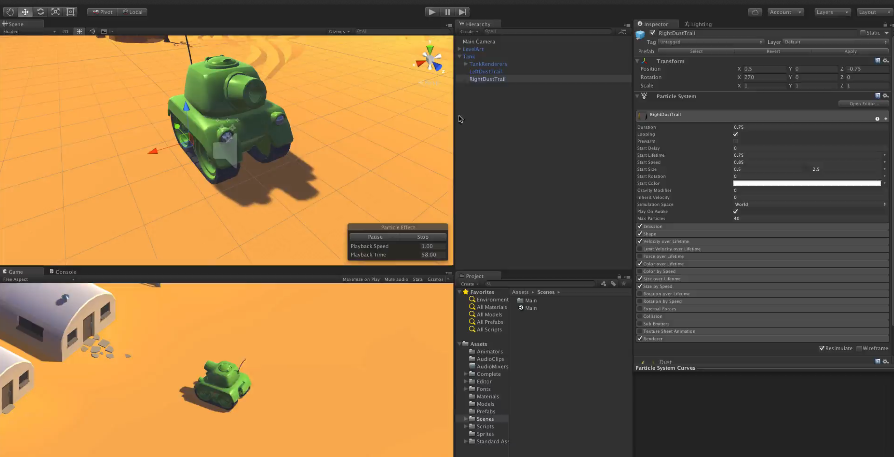

# Tanks!

This is my first video game built with Unity3D.

## Getting Started

```
git clone git@github.com:sanlouise/tanks_unity3d.git

cd tanks_unity3d
```

[Download](https://unity3d.com) and open Unity3D (select the tanks_unity3d folder you just cloned).

## Play the Game!

<div style="box-shadow: 0 12px 15px 0 rgba(0,0,0,0.24),0 17px 50px 0 rgba(0,0,0,0.19);"><a href="http://sandrahallie.com" alt="Sandra Hallie"><center></center></a></div>

## Credits

* [sanlouise](https://github.com/sanlouise)
* [kelsonic](https://github.com/kelsonic)

## License

MIT License. View it [here](LICENSE).
